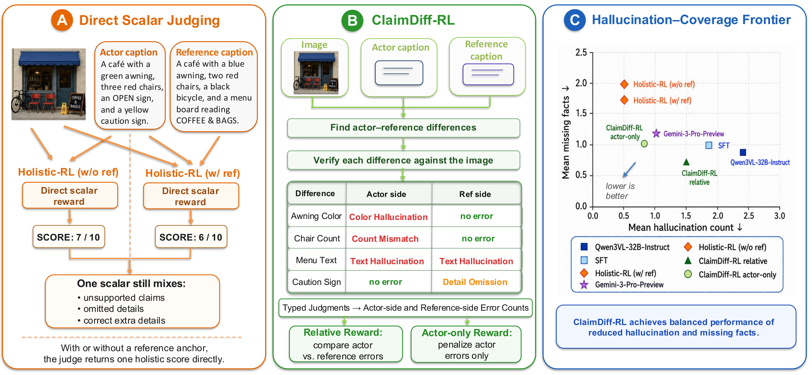

# ClaimDiff-RL

Claim-level Differential Reward for Vision-Language Caption RL.

ClaimDiff-RL improves image caption quality through reinforcement learning with a **claim-level differential reward**. Instead of scoring captions holistically, it decomposes the comparison between a model's caption and a reference caption into atomic **claim-level differences**, judges each against the image using a multimodal LLM (Gemini), and aggregates per-claim verdicts into a fine-grained reward signal for GRPO/PPO training.

<p align="center">
  
</p>

## TODO

- [ ] Release benchmark evaluation suite
- [ ] Release model weights

## Architecture

```
┌───────────────────────────────────────────────────────────────────┐
│                       Training Loop (verl)                        │
│                                                                   │
│  ┌────────────┐    ┌──────────┐    ┌──────────────────────────┐   │
│  │   Actor    │───>│ Rollout  │───>│  Remote Reward Manager   │   │
│  │ (Qwen3-VL) │    │ (SGLang) │    │ (sends to reward server) │   │
│  └────────────┘    └──────────┘    └────────────┬─────────────┘   │
│                                                 │                 │
└─────────────────────────────────────────────────┼─────────────────┘
                                                  │ HTTP
                                     ┌────────────▼───────────┐
                                     │   Reward Server        │
                                     │   (FastAPI)            │
                                     │                        │
                                     │  ┌──────────────────┐  │
                                     │  │ ClaimDiff        │  │
                                     │  │ Verifier         │  │
                                     │  │                  │  │
                                     │  │ 1. Extract claims│  │
                                     │  │ 2. Compare A↔B   │  │
                                     │  │ 3. Judge via     │  │
                                     │  │    Gemini+Image  │  │
                                     │  │ 4. Aggregate     │  │
                                     │  │    reward        │  │
                                     │  └──────────────────┘  │
                                     └────────────────────────┘
```

**Reward flow:**
1. The actor model generates a caption (Caption A) for an image.
2. The caption, along with a reference caption (Caption B, e.g., from Gemini), is sent to the reward server.
3. The ClaimDiff verifier prompts Gemini to identify **atomic differences** between the two captions, each with an ASPECT, per-caption CLAIM, JUDGMENT, and ERROR_TYPE.
4. Error counts (optionally severity-weighted) are aggregated into a scalar reward using configurable modes (`normalized_diff`, `normalized_a_only`, `judgment_based`, etc.).
5. The reward drives GRPO/PPO updates.

## Repository Structure

```
ClaimDiff-RL/
├── README.md
├── requirements.txt
├── reward_server/                    # Standalone reward server
│   ├── reward_serving_fastapi.py     # FastAPI app with /judge endpoint
│   ├── docker/
│   │   └── Dockerfile
│   └── verifier/
│       ├── __init__.py
│       ├── main.py                   # Verifier registry & BaseVerifier ABC
│       ├── helper.py                 # Format reward (think/answer tags)
│       ├── utils_caption_diff.py     # Core ClaimDiff verifier (gemini_caption_diff)
│       ├── utils_caption_diff_judge.py  # F1-based judge verifier (caption_judge)
│       └── utils_caption_holistic.py    # Holistic baseline verifier (B1)
├── recipe/
│   ├── caption_dataset.py            # Custom dataset class for caption RL
│   ├── config/
│   │   └── caption.yaml              # Hydra config
│   ├── scripts/
│   │   └── run_qwen3vl_caption_rl.sh # Training launch script
│   └── data/
│       └── convert_caption_train_data.py  # Data conversion example
└── verl_patch/
    └── workers/
        └── reward_manager/
            ├── remote.py             # Remote reward manager (register as "remote")
            └── remote_proxy.py       # HTTP proxy for reward server communication
```

## Prerequisites

- Python 3.10+
- PyTorch 2.1+
- [verl](https://github.com/volcengine/verl) framework (v0.6+)
- A Gemini API key (for the reward server's claim-diff judge)
- 8+ GPUs (tested on 8xA100/H100)

## Setup

### 1. Install verl

```bash
git clone https://github.com/volcengine/verl.git
cd verl
pip install -e .
```

### 2. Install dependencies

```bash
pip install -r requirements.txt
```

### 3. Apply verl patches

Copy the remote reward manager into your verl installation:

```bash
cp verl_patch/workers/reward_manager/remote.py \
   <verl_install_path>/verl/workers/reward_manager/remote.py
cp verl_patch/workers/reward_manager/remote_proxy.py \
   <verl_install_path>/verl/workers/reward_manager/remote_proxy.py
```

Register the remote reward manager in `<verl_install_path>/verl/workers/reward_manager/__init__.py`:

```python
from .remote import RemoteRewardManager
```

### 4. Prepare data

Training data should be in **Parquet** format with these columns:

| Column | Type | Description |
|--------|------|-------------|
| `images` | `str` (JSON) | `'["/path/to/image.jpg"]'` |
| `data_source` | `str` | Dataset identifier |
| `prompt` | `str` (JSON) | Chat-format messages, e.g., `'[{"role":"user","content":"<image> Describe this image."}]'` |
| `reward_model` | `str` (JSON) | `{"answer":"", "ground_truth":"<reference caption>", "verifier":"gemini_caption_diff", "verifier_parm":{"image_path":"/path/to/image.jpg"}, "format_ratio":0.0}` |
| `extra_info` | `str` (JSON) | `{"id":"...", "image_path":"/path/to/image.jpg", "question":"..."}` |
| `max_image_token` | `int` | Max image tokens (e.g., `8192`) |

See `recipe/data/convert_caption_train_data.py` for a conversion example.

## Running

### Step 1: Start the reward server

```bash
export GEMINI_API_KEY=<your-gemini-api-key>

# Optional: configure model and reward behavior
export GEMINI_MODEL_NAME=gemini-2.5-flash       # Default: gemini-2.5-flash
export ERROR_DIFF_MODE=normalized_a_only         # See "Reward Modes" below
export DIFF_PROMPT_VERSION=v5                    # v1, v2, v4, v5, v6

cd reward_server
python reward_serving_fastapi.py
```

The server starts on port 8000 with 8 workers. Deploy multiple instances for higher throughput.

### Step 2: Launch training

```bash
export ACTOR_LOAD_PATH=/path/to/Qwen3-VL-8B
export DATA_TRAIN_FILE=/path/to/train.parquet
export DATA_VAL_FILE=/path/to/val.parquet
export TRAIN_SAVE_PATH=/path/to/checkpoints
export _REMOTE_REWARD_JOB_ID=<reward-server-host>
export _REMOTE_REWARD_WORKER_NUM=1
export _REMOTE_REWARD_SERVER_PORT=8000

bash recipe/scripts/run_qwen3vl_caption_rl.sh
```

## Reward Modes

The `ERROR_DIFF_MODE` environment variable controls how claim-level error counts are converted to reward scores:

| Mode | Formula | Description |
|------|---------|-------------|
| `normalized_diff` | `(A_errors - B_errors) / total_diffs` | Relative error difference, normalized. Default. |
| `normalized_a_only` | `f(A_errors, total_diffs)` | Smooth reward based only on actor errors. Uses exponential decay with difficulty bonus. |
| `a_only` | Linear map of raw A error count | Actor errors only, linear reward mapping. |
| `judgment_based` | `-(A_wins - B_wins) / total_diffs` | Based on per-claim JUDGMENT field winners. |
| `raw_diff` | `A_errors - B_errors` | Raw difference without normalization. |
| `hall_vs_miss` | Hallucination + missing fact penalty | Image-verified hallucination detection. |

## Verifier Types

| Verifier | Registry Name | Description |
|----------|--------------|-------------|
| `GeminiCaptionDiffVerifier` | `gemini_caption_diff` | **Core.** Decomposes captions into claim-level diffs and scores via Gemini. |
| `CaptionJudgeVerifier` | `caption_judge` | Model predicts diffs, Gemini judges pred vs GT with image → F1 reward. |
| `GeminiCaptionHolisticVerifier` | `gemini_caption_holistic` | Baseline (B1). Holistic 0-10 score without decomposition. |

## Configuration Reference

### Reward Server Environment Variables

| Variable | Default | Description |
|----------|---------|-------------|
| `GEMINI_API_KEY` | (required) | Gemini API key |
| `GEMINI_API_BASE` | Google's API | Gemini API base URL |
| `GEMINI_MODEL_NAME` | `gemini-2.5-flash` | Gemini model to use |
| `ERROR_DIFF_MODE` | `normalized_diff` | Reward computation mode |
| `DIFF_PROMPT_VERSION` | `v1` | Diff prompt version (v1/v2/v4/v5/v6) |
| `USE_SEVERITY_WEIGHTED_REWARD` | `false` | Weight errors by severity (1/2/3) |
| `USE_AMBIGUITY_PENALTY` | `false` | Penalize hedging language |
| `REQUIRE_THINK_BLOCK` | `false` | Require `<think>` and `<answer>` tags |
| `MAX_RETRIES` | `8` | Max API retries per request |
| `LOG_SAMPLE_RATE` | `0.1` | Fraction of requests to log |
| `SAVE_TRAINING_DATA` | `false` | Save reward data to JSONL |
| `SAVE_TRAINING_DATA_PATH` | - | JSONL output path |

### Training Script Variables

| Variable | Default | Description |
|----------|---------|-------------|
| `ACTOR_LOAD_PATH` | (required) | HuggingFace model path |
| `DATA_TRAIN_FILE` | (required) | Training parquet file |
| `ROLLOUT_N` | `4` | Number of rollout samples per prompt |
| `ACTOR_LR` | `1e-6` | Actor learning rate |
| `ALGO_ADV_ESTIMATOR` | `grpo` | Advantage estimator (`grpo` or `gae`) |
| `FREEZE_VISION_TOWER` | `True` | Freeze the vision encoder |
| `ACC_SCALE_RANGE` | `[0, 1.0]` | Scale range for accuracy reward |

## License

Apache License 2.0
